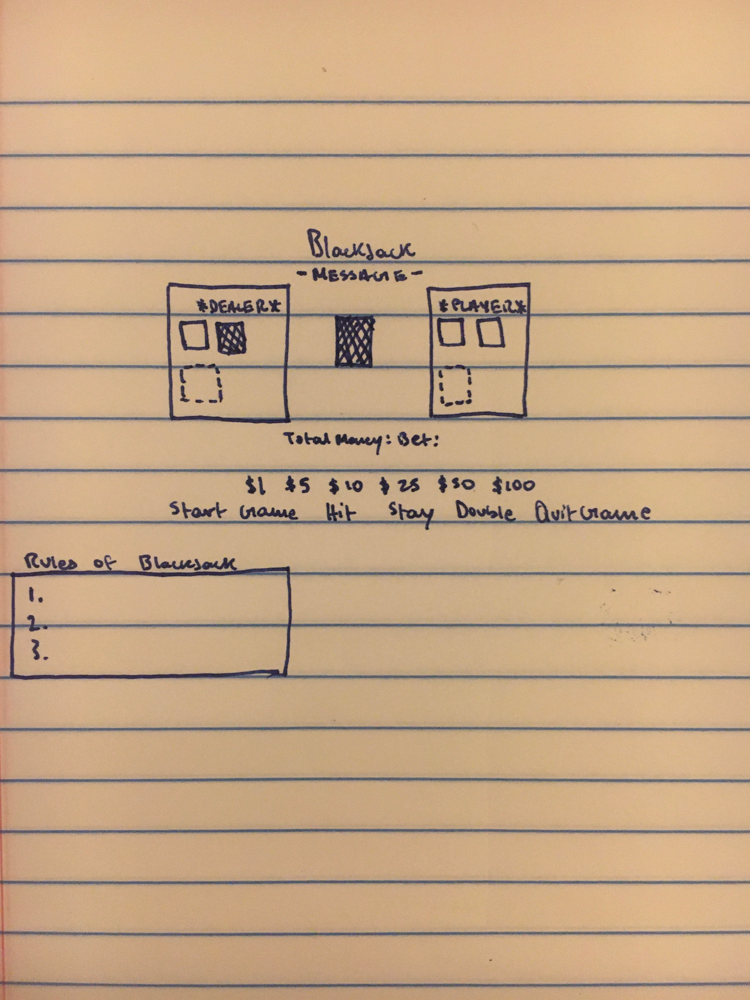
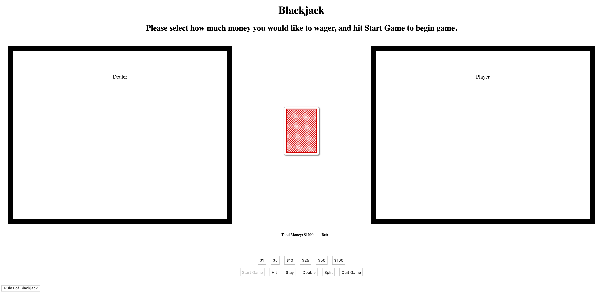
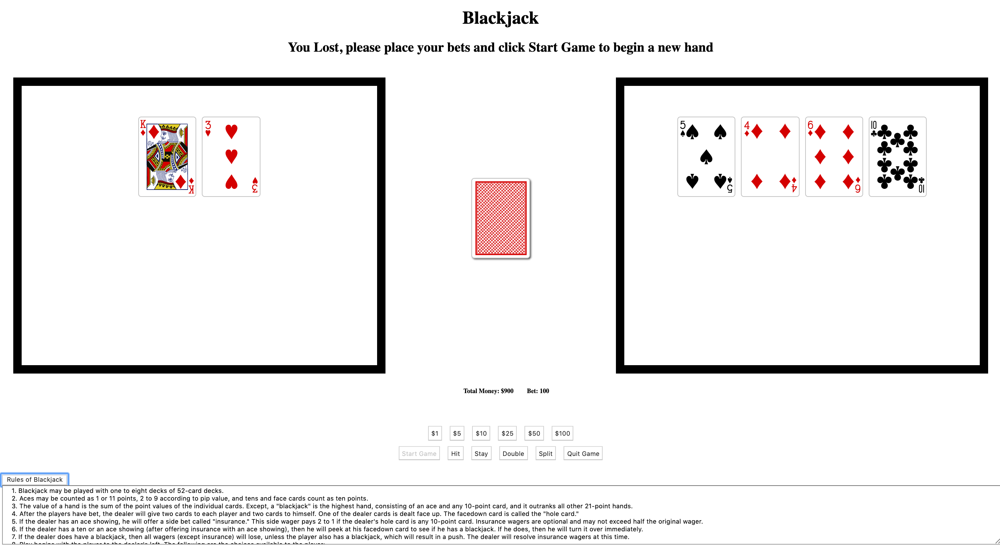

# Blackjack

## Introduction:
Blackjack was the first ever card game I ever learned, to this day, it's the card game I always wish to lose to in the casino

## Play the game:
https://sumardey5.github.io/BlackjackRepo/

## View of Game:

## Technology Implemented:
- JavaScript
- CSS
- HTML
- Git 

## Pseudocode:
- User places bets
- User starts game
- User has blackjack
- If user does not have blackjack, they have three options:
  1. Hit - until card value reaches 21, over 21, or wishes to stop hitting (stay)
  2. Stay - user likes their current card value
  3. Double - doubles current bet, renders one more card, and compars card value (if not over 21)
- User has either won, lost (bust or dealer has 21/better card value), or push (dealer and player have the same card values under 21)
- User continues with the game (same steps above) or quits game

# User Experience:
## User Persona #1:
Alan learned card counting becuase he was coming with his future brother-in-law and his friends to Las Vegas for a bachelor party. After some run ins with the law and local gangsters, he needed to win some cash to safely return home, so he started practicing his skills on here to prepare for the casino.

## User Persona #2:
Ben is about to graduate from MIT and plans on going to John Hopkins Medical School to become a doctor, however, medical school is not cheap, so he starts playing blackjack in order to afford it and practices his skills on here before he heads off to Vegas.

## Minimum Viable Product:
- As a user, I should be able to wager money (up to $1000).
- As a user, I should be able to start a game and recieve 2 intial cards.
- As a user, I should be able to get more cards (hit), double my wager (double), or not do anything (stay).
- As a user, I should see a message if I win or lose the game.
- As a user, I should be able to play again with the amount of money I lost or won.
- As a user, I should be able to quit and restart the game

## Next Steps:
- [Game] Add full in-game features: split, insurance, surrender, and side bets
- [Platform] Add APIs (being able to share game results with friends on Facebook)
- [Platform] Allow multiple users to play at the same time
- [Platform] DB to keep track of users playing history
- [Platform] Online playing functionaility
